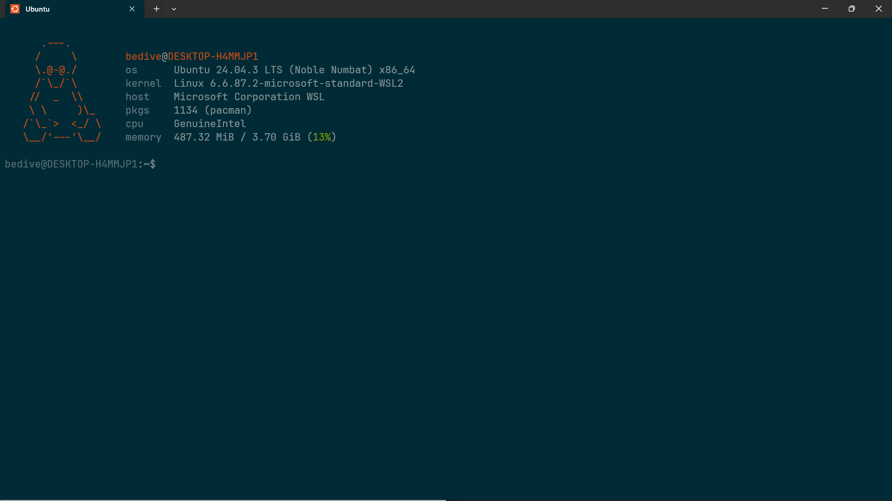

# Dotfiles – My Personal Configuration

This repository contains my personal **dotfiles**, including configuration for **Neovim** and **Fastfetch**.
The Neovim setup is inspired by [Mon4sm/monasm-dots](https://github.com/Mon4sm/monasm-dots/tree/main/.config/nvim), with custom tweaks to match my workflow and preferences.

---

## Structure

```

~/dotfiles/
├── nvim/
│   ├── init.lua
│   ├── lua/
│   └── lazy-lock.json
└── fastfetch/
│   └── lazy-lock.json
│   └── linux.txt
└── README.md

```

## Requirements

* **Neovim ≥ 0.9**
* **Git**
* **ripgrep**, **fd**, etc. (for Telescope)
* **Fastfetch** (system info display)
* **Nerd Font** (for icons)
* Recommended terminal: **WezTerm** / **Alacritty**

---

## Installation

Clone this repo to your local machine:

```bash
git clone https://github.com/bedive-215/dotfile.git ~/dotfiles
```

Then link the configurations:

```bash
ln -s ~/dotfiles/nvim ~/.config/nvim
ln -s ~/dotfiles/fastfetch ~/.config/fastfetch
```

Or use GNU Stow if you prefer:

```bash
cd ~/dotfiles
stow .
```

---

## Highlights

### Neovim

* Plugin manager: [lazy.nvim](https://github.com/folke/lazy.nvim)
* Language Server Protocol (LSP) integration
* Treesitter for syntax highlighting
* Telescope for fuzzy finding
* Custom keymaps and lightweight UI

### Fastfetch

* Displays system info (CPU, RAM, OS, GPU, etc.) when opening a terminal
* Configured for a clean and minimal look
* Config file: `.config/fastfetch/config.jsonc`

---

## Preview



---

## Credits

* Neovim structure inspired by [Mon4sm/monasm-dots](https://github.com/Mon4sm/monasm-dots)
* Fastfetch: [https://github.com/fastfetch-cli/fastfetch](https://github.com/fastfetch-cli/fastfetch)

---

## License

Free to learn, copy, and modify for personal use.
